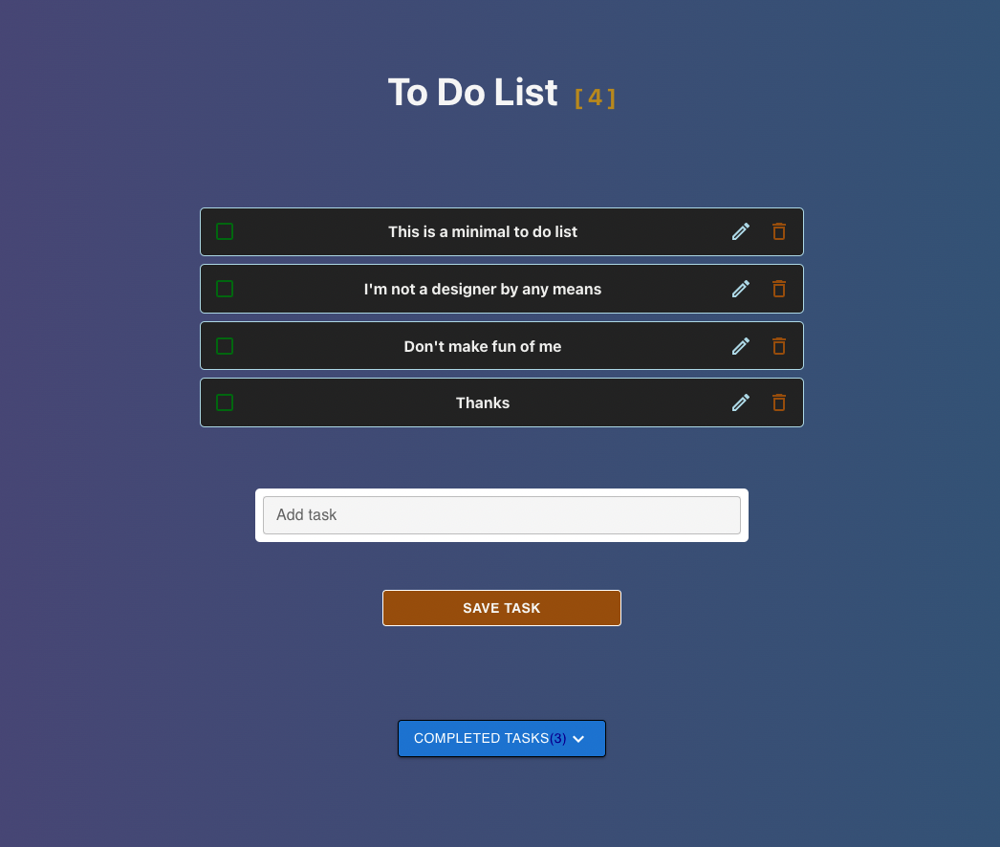

### About

A simple to-do-list to learn some React. No backend is used for this app. Instead the data is stored locally. 

### Functions

:no_entry: Delete task :white_check_mark: Finish task

:pencil2:	Edit task :no_entry_sign: Undo finish task	

  

### Technologies

Built with ReactJS & MaterialUI